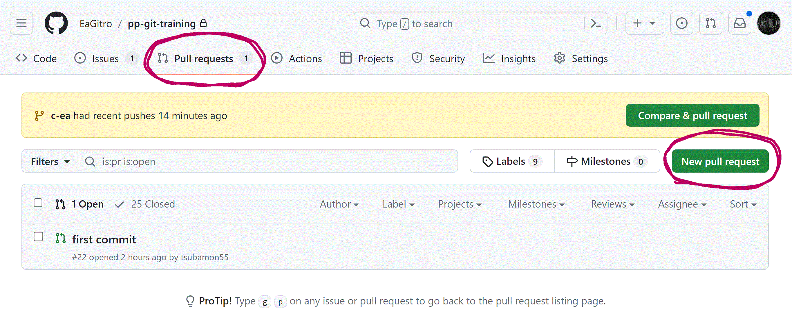
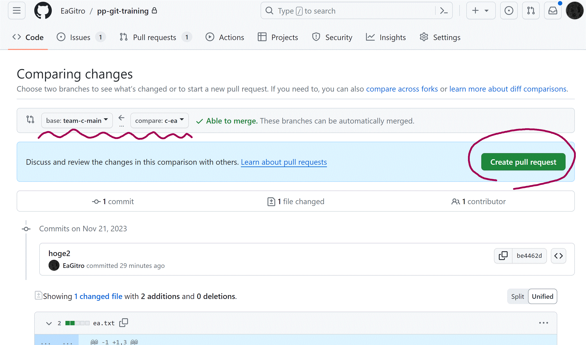

# PiedPiper-git-training


## 個人パート

1. まずチームのメインに入る `team-a-mian`。自分のブランチを派生させる。ブランチめいは`チーム名-自分のGitHubの名前` などにする。例)`d-eagitro` 
	1. ブランチを移動するために `git switch 自分のブランチ名` にする
	2. 自分のブランチにいることを `git branch` で確認(自分がいるブランチにアスタリスクがでる)
2. 自分のブランチでファイル作成
	1. `git status` で状態を確認
3. `git add . ` でステージングエリアに追加
4. `git commit -m "hogehoge"` でコミット	    


## 共同開発パート


1. まずチームのメインに入る `team-a-mian`。そこから自分の個人のブランチを派生させ、そこで以下のような作業。ブランチめいは`チーム名-自分のGitHubの名前` などにする。例)`d-eagitro`     
	(本来はいろいろ作法があるが、今回は自分がわかればいい。知りたい人は `git flow`, `github flow` 等で調べると出てくるかも)
	1. まずはローカルで`自分のGithubの名前.txt` をさくせい。何か書き込んで、 add, commit, **チームのメインに** push (全体の main には push しない)。
		1. 適宜 `git status` 等で確認する。
	2. 他の人が行った変更を、**チームのメインに** merge. (GitHub 上でプルリクエストを出す)
	3. 自分のローカルにも他の人の変更を更新する
		1. 自分のローカルリポジトリの**チームのメイン**に pull
		2. 自分のブランチに変更を適用
	4. 次に複数人ですでにある `チーム名.txt` に同時に書き込み。コンフリクトを起こさせる。
		1. それを解決する方法を考える
			1. GitHub 上・ローカル上で手作業
			2. `git checkout --theirs/--ours` ...etc


## やったこと

- やったことをそのまま議事録にしたよ!


### ローカルで作業しよう!

- ローカルでまずは clone してリポジトリを作成しよう!
- そのあと **自分のチームのメインブランチ** に入ろう
	- 自分のブランチをそこから派生させよう
- `add`, `commit` しよう!
- `.gitignore` について学ぼう!

#### clone 
1. `git clone https://github.com/EaGitro/pp-git-training.git` でリポジトリをクローン
2. clone すると、その下にプロジェクトファイルがダウンロードされる
	1. `ls` で確認すると、下に `pp-git-training` がある
	2. なので `cd pp-git-training` で移動
	3. 	```sh
		> ls
		pp-git-training

		> cd pp-git-training
		```

#### ブランチ関係
1. 移動したら、 `git branch` で自分がどのブランチにいるか確認する
	1. まだブランチが `main` しかないはずである(リモートにグループのブランチはあるが、表示されない。表示するには `git branch -a` とする)
		```sh
		> git branch
		* main 

		> git branch -a
		* main
		 remotes/origin/HEAD -> origin/main
		 remotes/origin/d-Sora339
		 remotes/origin/main
		 remotes/origin/naoya
		 remotes/origin/team-a-main
		 remotes/origin/team-b-main
		 remotes/origin/team-c-main
		 remotes/origin/team-d-main
		``` 
1. ここで自分のチームのメインに移動する。`git switch team-c-main`. 移動したら移動できているか `git branch` で確認
	1. 	```sh
		> git switch team-c-main
		Switched to a new branch 'team-c-main'
		branch 'team-c-main' set up to track 'origin/team-c-main'.

		> git branch
		  main
		* team-c-main
		```
1. 自分のチームのメインブランチにいることを確認して、 `git branch 自分のブランチ名` で自分のブランチを派生。そこに移動 `git switch 自分のブランチ名`。
	1. 	```sh
		> git branch c-ea

		> git branch
		  c-ea			# 自分のブランチが出来ていることを確認
		  main
		* team-c-main

		> git switch c-ea
		Switched to branch 'c-ea'

		> git branch
		* c-ea
 		  main
		  team-c-main
		```

#### 自分のブランチに変更を加えよう!

1. ローカルでファイル作成(自分のブランチにいることを確認して)
	1. `echo "hoge" >> ea.txt`


#### .gitignore しよう!
1. **リモートにファイルを上げないためにいらないファイルは `.gitignore` しよう！**
	1. みんなで `gomi.txt` をつくる
	2. 	```sh
		> echo "gomi.txt" >> gomi.txt		# これを ignore

		> git status
		On branch c-ea
		Changes to be committed:
		(use "git restore --staged <file>..." to unstage)
				new file:   ea.txt

		Untracked files:
		(use "git add <file>..." to include in what will be committed)
				gomi.txt
		```
		```txt
		# .gitignore
		gomi.txt
		.gitignore		# 今回はこれも ignore
		```
	3. もう一回 `git status` で確認
		1.  ```sh
			> git status		# 消えた!
			On branch c-ea
			Changes to be committed:
			(use "git restore --staged <file>..." to unstage)
					new file:   ea.txt
			```

#### add しよう!

1. `ls` で確認
1. `git status` で現在の状況を確認
	1. 	```sh
		> git status
		On branch c-ea
		Untracked files:
		(use "git add <file>..." to include in what will be committed)
				ea.txt

		nothing added to commit but untracked files present (use "git add" to track)
		```
4. `git add .` でステージングエリアに追加
	1. `git status` で確認
		```sh
		> git status
		On branch c-ea
		Changes to be committed:
		(use "git restore --staged <file>..." to unstage)
				new file:   ea.txt
		```
	2. `add` したものの取り消し方
		1. `git reset <ファイル名>` 
			1. ステージングエリアのファイルを取り消し

#### commit しよう!
1. `git commit -m "コミットメッセージ"` でコミット
	1. 	```sh
		> git commit -m "pp"
		[c-ea 5f1d75d] pp
		1 file changed, 1 insertion(+)
		create mode 100644 ea.txt

		> git status		# 確認しよう
		On branch c-ea
		nothing to commit, working tree clean
		```
	1. コミットを取り消し
		1. `git reset --soft <commit id>` : コミットのみを取り消し、ある時点のコミットと同じ状態にする。ステージングエリアは変更しない。`HEAD^` で直前のコミットを取り消し(1つ前のコミットと同じ状態に)。`HEAD` で直前のコミットと同じ状態に。
		2. `git reset --mixed <commit id>` : --soft と似ているがステージングエリアも変化。
		3. `git reset --hard <commit id>` : 上記2つと似るが、ファイル⾃体も指定されたコミットと同じ状態にする。

### リモートブランチとつなごう!

#### push しよう!
1. `push` する
	1. `git push -u origin 自分のブランチ` でリモートに自分のブランチを作成、変更を適用
		1. `-u origin 自分のブランチ` で **上流ブランチ** をつくる(他のブランチに追跡されるブランチ)

		```sh
		> git push -u origin c-ea
		Enumerating objects: 5, done.
		Counting objects: 100% (5/5), done.
		Delta compression using up to 8 threads
		Compressing objects: 100% (2/2), done.
		Writing objects: 100% (3/3), 264 bytes | 264.00 KiB/s, done.
		Total 3 (delta 1), reused 0 (delta 0), pack-reused 0
		remote: Resolving deltas: 100% (1/1), completed with 1 local object.
		remote:
		remote: Create a pull request for 'c-ea' on GitHub by visiting:
		remote:      https://github.com/EaGitro/pp-git-training/pull/new/c-ea
		remote:
		To https://github.com/EaGitro/pp-git-training.git
		* [new branch]      c-ea -> c-ea
		branch 'c-ea' set up to track 'origin/c-ea'.
		```
1. ちなみにこの後ローカルブランチに何か変更を加えて **`add`, `commit` した後**、 `git status` とすると以下のようになる
	```sh
	> git status
	On branch c-ea
	Your branch is ahead of 'origin/c-ea' by 1 commit.
	(use "git push" to publish your local commits)
	```


#### Pull request して merge してもらおう!

1. **GitHub上にて** **`自分のブランチのプルリクエストを出す => merge してもらう`** ということをする
	1. GitHub のページ([https://github.com/EaGitro/pp-git-training](https://github.com/EaGitro/pp-git-training))にアクセスする
	1. `Pull requests` というメニュー([https://github.com/EaGitro/pp-git-training/pulls](https://github.com/EaGitro/pp-git-training/pulls))から、`New pull request` というボタンを押す。(下図)
		
	
	1. 次にどのブランチとどのブランチを merge するか選択する。   
	`base: 自分のチームのメイン ▾ <- compare: 自分のブランチ ▾` というように選択し、 `Create pull request` を押す。(下図)    
		
	
	1. Pull request の説明を書き、`Create pull request` を押す。
	1. チームの誰かに merge してもらおう!


#### 自分のブランチに変更を持って来よう!


1. **Git に戻って**、**`remote のチームのメイン => local のチームのメイン => 自分のブランチ`** という流れで情報を更新しよう!
	1. まずは `git switch チームのメイン` でチームのメインブランチに移ろう!   
	そこで `git pull` してリモートのチームのメインの変更を自分のPCのチームのメインに適用しよう!  
		```sh
		> git switch team-c-main			# チームのメインに移動
		Switched to branch 'team-c-main'
		Your branch is up to date with 'origin/team-c-main'.

		> git pull
		remote: Enumerating objects: 91, done.
		remote: Counting objects: 100% (36/36), done.
		remote: Compressing objects: 100% (33/33), done.
		Unpacking objects:  51% (47/91), 4.20 KiB | 8.00 KiB
		From https://github.com/EaGitro/pp-git-training
		abafaca..eafdefa  team-c-main   -> origin/team-c-main
		* [new branch]      a-Sakana      -> origin/a-Sakana
		...
		Updating abafaca..eafdefa
		Fast-forward
		ea.txt       |   1 +
		test.txt     |   1 +
		wakuwaku.txt |   1 +
		wctk.txt     | Bin 0 -> 14 bytes
		4 files changed, 3 insertions(+)
		create mode 100644 ea.txt
		create mode 100644 test.txt
		create mode 100644 wakuwaku.txt
		create mode 100644 wctk.txt

		> ls			# みんなのファイルがローカルにきた!
		 .gitignore
		 ea.txt
		 gomi.txt
		 README.md
		 test.txt
		 wakuwaku.txt
		 wctk.txt
		```
	1. つぎに `git switch 自分のブランチ` で自分のブランチに移動しよう     
	そこで `git merge チームのメイン` で **チームのメインの変更を自分のブランチに引っ張ってこよう!**   
		```sh
		> git switch c-ea			# 自分のブランチに移動
		Switched to branch 'c-ea'
		Your branch is up to date with 'origin/c-ea'.

		> git merge team-c-main		# チームのメインの変更を統合!
		Updating 68da0bd..eafdefa
		 wakuwaku.txt |   1 +
		 wctk.txt     | Bin 0 -> 14 bytes
		 3 files changed, 2 insertions(+)
		 create mode 100644 test.txt
		 create mode 100644 wakuwaku.txt
		
		> ls						# みんなのファイルが自分のブランチに!
		 .gitignore 
		 ea.txt  
		 gomi.txt
		 README.md
		 test.txt
		 wakuwaku.txt
		 wctk.txt
		```
	
1. 終わりです! よく頑張りました!